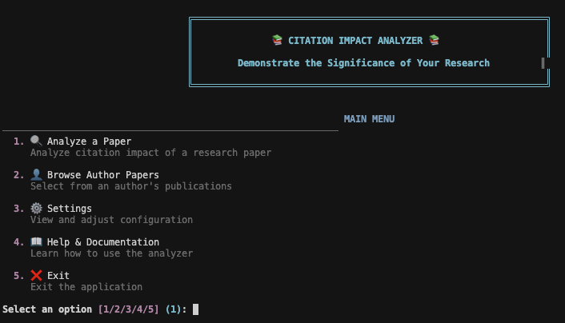
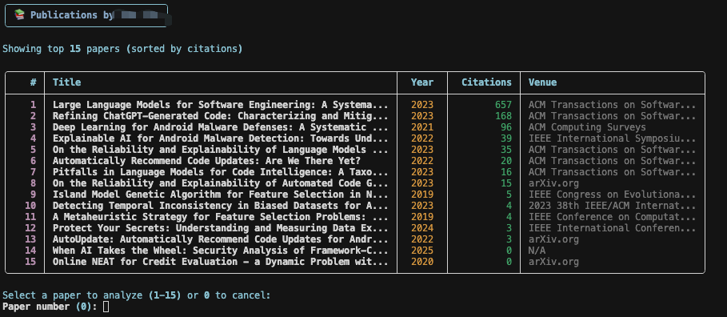
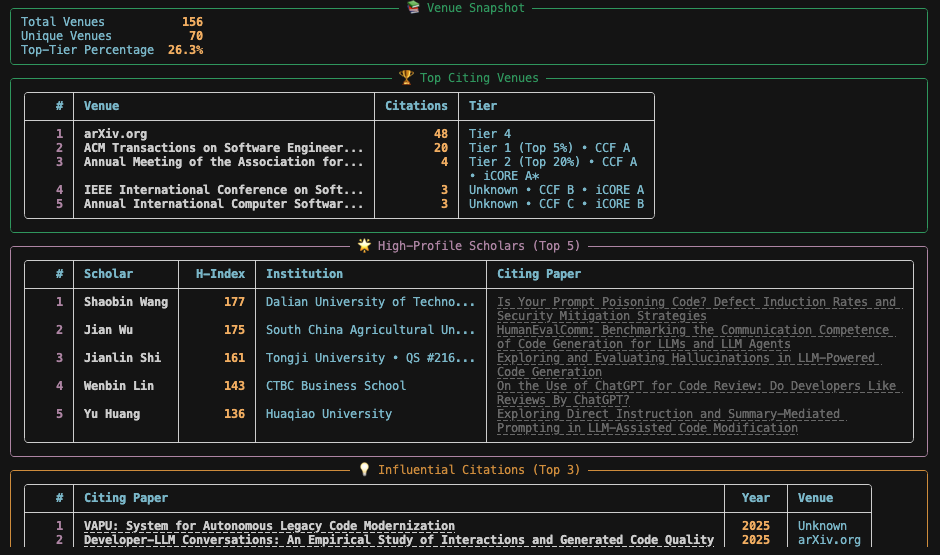

# CitationImpact 📊

<p align="center">
  
</p>

<p align="center">
  <strong>Turn your citations into compelling evidence for grants and promotions</strong>
</p>

---

## Why I Built This

Hi academic folks! 👋

If you've ever written a grant proposal or prepared for a performance review, you know the struggle: **you need to prove your research impact, but citation counts alone don't tell the whole story.**

Reviewers want to know:
- *Who* is citing your work? (Are they leading researchers?)
- *Where* are the citations coming from? (Top universities? Industry labs?)
- *How* is your work being used? (Building on your methods? Extending your ideas?)

I built CitationImpact to answer these questions automatically. Instead of manually digging through hundreds of citations, this tool analyzes them for you and generates a comprehensive impact report in minutes.

---

## What It Does

CitationImpact analyzes your research citations and identifies:

- 🎯 **Influential citations** – Papers that build on or extend your methodology
- 👥 **High-profile scholars** – Prominent researchers (by h-index) citing your work  
- 🏛️ **Institution breakdown** – Universities (with QS/US News rankings), Industry, Government
- 📚 **Venue quality** – Top-tier journals/conferences (CORE, CCF, h-index rankings)
- 💾 **Smart caching** – Never wait twice for the same analysis

---

## Quick Start

### 1. Install Dependencies

```bash
pip install -r requirements.txt
```

### 2. Run the Tool

```bash
./citation-impact
```

That's it! The interactive menu will guide you through the rest.

<p align="center">
  
</p>

---

## How to Use

### Option 1: Analyze a Paper

1. Run `./citation-impact`
2. Select **"1. Analyze a Paper"**
3. Enter your paper title
4. Wait a minute while it fetches and analyzes citations
5. Get your impact report!

<p align="center">
  
</p>

### Option 2: Browse Your Publications

If you have multiple papers, you can browse them by author:

1. Select **"2. Browse Author Papers"**
2. Enter your **Semantic Scholar ID** or **Google Scholar ID**
3. Pick a paper from the list
4. Analyze it with one click

**Pro tip:** Save your author ID in Settings (option 6 or 7) so you don't have to enter it every time!

<p align="center">
  
</p>

---

## What You Get

After analyzing a paper, you'll see:

### 📊 Overview
- Total citations and how many were analyzed
- Number of influential citations (AI-detected)
- High-profile scholars citing your work

### 🏛️ Institution Breakdown
- **Universities** – with QS/US News rankings (e.g., "MIT - QS #1")
- **Industry** – Google, Microsoft, Meta, etc.
- **Government** – NIH, DARPA, NASA, etc.

### 📚 Venue Analysis
- Top journals/conferences citing your work
- H-index rankings (Tier 1 = flagship venues)
- CORE, CCF, iCORE rankings for CS venues

### 🌟 High-Profile Scholars
- Researchers with h-index ≥ 20 (configurable)
- Their affiliations and university rankings
- Which papers they wrote that cite you

### 💡 Influential Citations
- Papers that significantly build on your work
- Citation contexts showing how they use your research
- Clickable links to read them

### 🔍 Interactive Drill-Down
- Click into any category to see full details
- View all papers from a specific venue
- See all scholars from a university
- Explore citation contexts

---

## Configuration

Access settings via **"3. Settings"** in the main menu:

| Setting | Description | Default |
|---------|-------------|---------|
| **H-Index Threshold** | Minimum h-index for "high-profile" scholars | 20 |
| **Max Citations** | How many citations to analyze | 100 |
| **Data Source** | `api` (fast) or `google_scholar` (comprehensive) | api |
| **Email** | For OpenAlex API (faster access) | None |
| **API Key** | Semantic Scholar key (optional, for higher rate limits) | None |
| **Default Semantic Scholar ID** | Your author ID (saves typing) | None |
| **Default Google Scholar ID** | Your Google Scholar ID | None |

**Get API keys (optional but recommended):**
- Semantic Scholar: https://www.semanticscholar.org/product/api
- OpenAlex: Just add your email (no key needed)

---

## Smart Caching

CitationImpact automatically caches everything:

- **Analysis results** → 7 days
- **Author profiles** → 30 days

**First analysis:** ~60 seconds (fetching data)  
**Second analysis:** ~1 second (from cache) ⚡

Cache is stored in `.citationimpact/` in your project folder. You can view statistics and clear it via **Settings → 8. Data Location & Cache**.

---

## Python API

If you prefer scripting:

```python
from citationimpact import analyze_paper_impact

result = analyze_paper_impact(
    paper_title="Your Paper Title",
    h_index_threshold=20,
    max_citations=100,
    email="your.email@edu"  # Recommended for faster API
)

# Access results
print(f"High-profile scholars: {len(result['high_profile_scholars'])}")
print(f"Top-tier venues: {result['venues']['top_tier_percentage']:.1f}%")

for scholar in result['high_profile_scholars'][:5]:
    print(f"- {scholar['name']} (h={scholar['h_index']}) - {scholar['affiliation']}")
```

---

## Example Output

```
📊 Impact Analysis Results
━━━━━━━━━━━━━━━━━━━━━━━━━━━━━━━━━━━━━━━━━━━━━━━━━━━━━━━━━━━━━━━━━

Paper: Refining ChatGPT-Generated Code: Characterizing and Mitigating Code Quality Issues

📈 Overview
  Total Citations           168
  Citations Analyzed        100
  High-Profile Scholars      23
  Influential Citations      12

🏛️ Institution Summary
  ┌────────────┬───────┬─────────┐
  │ Type       │ Count │ Percent │
  ├────────────┼───────┼─────────┤
  │ University │    74 │   74.7% │
  │ Industry   │     4 │    4.0% │
  │ Government │     3 │    3.0% │
  │ Other      │    18 │   18.2% │
  └────────────┴───────┴─────────┘

📚 Top Citing Venues
  1. ACM Transactions on Software Engineering (5 citations) • Tier 1 • CCF A
  2. IEEE Software (3 citations) • Tier 2 • CORE A
  3. ICSE 2024 (2 citations) • Tier 1 • CORE A* • CCF A

🌟 High-Profile Scholars (Top 5)
  1. John Doe (h=87) - Stanford University (QS #5)
  2. Jane Smith (h=65) - MIT (QS #1)
  3. Bob Johnson (h=54) - Google Research
```

---

## Data Sources

CitationImpact supports two modes:

### 1. API Mode (Recommended)
- **Fast** – No CAPTCHAs, reliable
- **AI-powered** – Detects influential citations automatically
- **Sources:** Semantic Scholar + OpenAlex
- **Best for:** Regular use, large citation counts

### 2. Google Scholar Mode
- **Comprehensive** – Finds papers not in Semantic Scholar
- **Slower** – Web scraping, may hit CAPTCHAs
- **Best for:** Papers missing from APIs

Switch modes in Settings → 3. Data Source.

---

## Venue & University Rankings

CitationImpact automatically enriches results with rankings:

### Venue Rankings
- **H-index tiers** – Works for any field (Tier 1 = h-index > 100)
- **CORE** – Computer Science conference rankings (A*, A, B, C)
- **CCF** – China Computer Federation rankings
- **iCORE** – International CORE rankings

### University Rankings
- **QS World Rankings** – Top 1,500 universities
- **US News Global Rankings** – Alternative rankings
- **Automatic matching** – Handles aliases (e.g., "MIT" = "Massachusetts Institute of Technology")

Rankings data is in `data/` folder. Update anytime:
```bash
python data/update_qs_rankings.py
python data/update_core_rankings.py
python data/update_usnews_rankings.py
```

---

## Use Cases

### 📝 Grant Proposals
Show reviewers:
- Citations from QS Top 10 universities
- Adoption by researchers with h-index > 50
- Publications in CORE A* venues
- Cross-sector impact (academia + industry + government)

### 🎓 Tenure & Promotion
Demonstrate:
- Quality over quantity (influential citations)
- Recognition by leading scholars
- Impact in top-tier venues
- International reach

### 📊 Progress Reports
Quantify:
- Growth in citations from prestigious institutions
- Methodological influence (papers building on your work)
- Breadth across research communities

---

## Project Structure

```
CitationImpact/
├── citation-impact              # Main executable (run this!)
├── README.md                    # You are here
├── requirements.txt             # Python dependencies
├── .citationimpact/            # Your data (auto-created)
│   ├── config.json             # Settings & API keys
│   ├── cache/                  # Analysis results (7 days)
│   └── author_cache/           # Author profiles (30 days)
├── citationimpact/             # Source code
│   ├── core/                   # Analysis engine
│   ├── clients/                # API clients (Semantic Scholar, OpenAlex, Google Scholar)
│   ├── ui/                     # Terminal interface
│   └── utils/                  # Rankings, institutions, etc.
├── data/                       # Ranking datasets
│   ├── university_rankings/    # QS, US News data
│   └── venues_rankings/        # CORE, CCF, iCORE data
```

---

## Troubleshooting

### Cache Not Working?
- Check `.citationimpact/cache/` folder exists
- View cache stats: Settings → 8
- Clear corrupted cache: Settings → 8 → Clear cache
- Cache saves after successful analysis (not during errors)

### Rate Limits?
- Add your email: Settings → 4
- Get Semantic Scholar API key: Settings → 5
- Use cached results when available

### Paper Not Found?
- Try exact title from Semantic Scholar or Google Scholar
- Use "Browse Author Papers" instead (option 2)
- Switch to Google Scholar mode if paper is very new

### Google Scholar CAPTCHAs?
- Switch to API mode (faster, no CAPTCHAs)
- Wait a few minutes between searches
- Use cached results

---

## Advanced: Python API

For scripting or integration:

```python
from citationimpact import analyze_paper_impact

# Basic usage
result = analyze_paper_impact(
    paper_title="Your Paper Title",
    h_index_threshold=20,
    max_citations=100,
    email="you@university.edu"
)

# Access results
scholars = result['high_profile_scholars']
venues = result['venues']['rankings']
institutions = result['institutions']

# With caching (default)
result = analyze_paper_impact(
    paper_title="Your Paper Title",
    use_cache=True  # Second run returns instantly
)

# Force fresh data
result = analyze_paper_impact(
    paper_title="Your Paper Title",
    use_cache=False  # Ignore cache
)
```

---

## Requirements

- Python 3.8+
- Internet connection
- No browser needed (pure API/scraping)

```bash
pip install -r requirements.txt
```

**Main dependencies:**
- `requests` – HTTP requests
- `rich` – Beautiful terminal UI
- `pandas` – Data processing
- `scholarly` – Google Scholar (optional)

---

## Privacy & Data

- **All processing is local** – No external servers except public APIs
- **API keys stored locally** – In `.citationimpact/config.json`
- **Cache is yours** – Stored in your project folder
- **No tracking** – We don't collect any data

**APIs used:**
- Semantic Scholar (public academic graph)
- OpenAlex (open bibliographic data)
- Google Scholar (optional, for comprehensive coverage)

---

## Contributing

Found a bug? Have an idea? Open an issue or PR!

**Areas for contribution:**
- Additional ranking sources (THE, ARWU, etc.)
- Export formats (PDF, LaTeX, CSV)
- Web interface
- Better citation context analysis

---

## License

Copyright (c) 2024. All rights reserved.

---

## Acknowledgments

**Built with:**
- [Cursor](https://cursor.sh) – AI-powered code editor
- [Claude](https://anthropic.com) – AI pair programming assistant

Special thanks to the open-source community and the teams behind Semantic Scholar, OpenAlex, and scholarly.

---


<p align="center">
  <strong>Happy analyzing! 🚀</strong>
</p>

<p align="center">
  <em>Remember: Citation metrics are one piece of the puzzle. Always interpret them alongside qualitative assessments of your research.</em>
</p>
