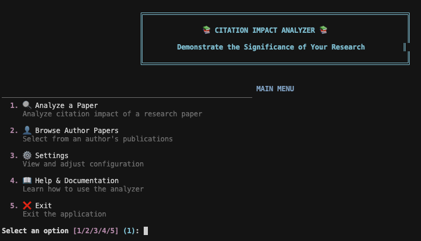
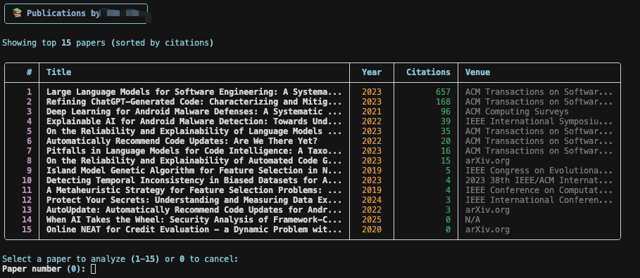
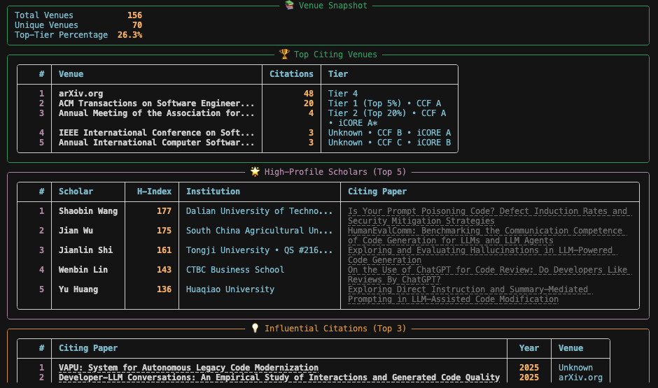

# CitationImpact 📊

<p align="center">
  
</p>

<p align="center">
  <strong>Turn your citations into compelling evidence for grants and promotions</strong>
</p>

---

## Why I Built This

Hi academic folks! 👋

If you've ever written a grant proposal or prepared for a performance review, you know the struggle: **you need to prove your research impact, but citation counts alone don't tell the whole story.**

Reviewers want to know:
- *Who* is citing your work? (Are they leading researchers?)
- *Where* are the citations coming from? (Top universities? Industry labs?)
- *How* is your work being used? (Building on your methods? Extending your ideas?)

I built CitationImpact to answer these questions automatically. Instead of manually digging through hundreds of citations, this tool analyzes them for you and generates a comprehensive impact report in minutes.

---

## What It Does

CitationImpact analyzes your research citations and generates **grant-ready impact statements**:

- 📋 **Grant Impact Summary** – Copy-ready statements for proposals & tenure files
- 🆔 **ID-first author matching** – Unique Semantic Scholar/Google Scholar IDs with publication-verified fallbacks; every author is marked ✓ ID-matched, ≈ verified, or ? name-only so you can trust the numbers
- 🌍 **Field-normalized impact** – FWCI & citation percentile from OpenAlex ("cited 4.2× the world average for its field")
- 🙋 **Self-citation detection** – Reports what % of citations are independent of the original authors
- 💬 **How your work is used** – Citation intent breakdown (methodology/background/result) with in-text quotes
- 🏆 **Highly-Cited Papers** – Papers with 100+ citations that cite YOUR work
- 👥 **High-profile scholars** – Prominent researchers (by h-index & total citations) citing your work  
- 🏛️ **Institution breakdown** – Universities (with QS/US News rankings), Industry, Government
- 📚 **Venue quality** – Top-tier journals/conferences (CORE, CCF, h-index rankings)
- 📈 **Citation velocity** – Track your impact over time with timeline visualization
- 🔗 **Clickable links** – Every author and paper is linked to their profile
- 💾 **Smart caching** – Never wait twice for the same analysis (user-controlled refresh)
- 📤 **Grant-ready exports** – Markdown, LaTeX, CSV, BibTeX, JSON (interactive or via CLI)

---

## Quick Start

### 1. Install Dependencies

```bash
pip install -r requirements.txt
```

### 2. Run the Tool

```bash
./citation-impact
```

That's it! The interactive menu will guide you through the rest.

Prefer scripting? There's a non-interactive mode too:

```bash
./citation-impact analyze "Your Paper Title" --format markdown -o report.md
./citation-impact analyze "Your Paper Title" --format latex -o -   # print to stdout
./citation-impact cache list
```

<p align="center">
  
</p>

---

## How to Use

### Option 1: My Papers (Recommended)

**Fastest way** – uses your saved profile, minimal CAPTCHAs:

1. Run `./citation-impact`
2. Go to **Settings** → Set your Google Scholar ID
3. Select **"1. 📚 My Papers"**
4. Pick any of YOUR papers from the list
5. Get your impact report instantly!

### Option 2: Analyze Any Paper

1. Run `./citation-impact`
2. Select **"2. 🔍 Search Any Paper"**
3. Enter any paper title
4. Wait a minute while it fetches and analyzes citations
5. Get your impact report!

<p align="center">
  
</p>

### Option 3: Browse Another Author's Papers

Want to analyze papers by someone else?

1. Select **"3. 👤 Browse Other Authors"**
2. Enter their **Semantic Scholar ID** or **Google Scholar ID** (most accurate), or just their name
3. If several researchers share that name, pick the right one from the candidate list (shown with affiliation, h-index, and paper count)
4. Pick a paper from the list and analyze it with one click

**Pro tip:** Save your own author ID in Settings so "My Papers" works instantly!

<p align="center">
  
</p>

---

## What You Get

After analyzing a paper, you'll see:

### 📋 Grant Impact Summary
- **Ready-to-use statements** – Copy directly into grant proposals
- **Key metrics** – High-profile scholars, QS Top 100, highly-cited papers
- **Quick copy text** – One-liner for your CV or bio
- **Evidence table** – Highly-cited papers (100+ citations) that cite you

Example output:
```
✨ Ready-to-Use Impact Statements:
1. Cited by 12 papers with 100+ citations, demonstrating adoption by high-impact research.
2. Recognized by 23 high-profile researchers (h-index ≥ 20), including scholars with h-index up to 87.
3. Adopted by researchers from 15 QS Top 100 universities worldwide.

📝 Quick Copy Text:
"This work has been cited 168 times, including by 23 high-profile researchers 
(h-index ≥ 20) from 15 QS Top 100 universities."
```

### 📄 All Citing Papers
- See exactly WHO cites your work with **clickable links**
- **Citation counts** for each citing paper (shows how cited THEY are)
- **Sort by** year, citation count, or venue
- View **authors** of any paper with one click

```
╭──────┬─────────────────────────────────────────┬────────┬────────────────────────┬────────┬─────╮
│ #    │ Paper (click)                           │  Year  │ Venue                  │  Cites │ 🌟  │
├──────┼─────────────────────────────────────────┼────────┼────────────────────────┼────────┼─────┤
│ 1    │ Refining chatgpt-generated code...      │  2024  │ ACM Transactions on... │    175 │ ⭐  │
│ 2    │ Security weaknesses of copilot...       │  2025  │ ACM Transactions on... │     97 │ ⭐  │
╰──────┴─────────────────────────────────────────┴────────┴────────────────────────┴────────┴─────╯
⭐ = Influential citation
```

### 📊 Overview
- Total citations and how many were analyzed
- Number of influential citations (AI-detected)
- High-profile scholars citing your work

### 👥 All Citing Authors
- **Every author** with **clickable profile links** (Google Scholar / Semantic Scholar)
- **H-index** with source indicator (e.g., `38 (GS)` = from Google Scholar)
- **Total citations** from their profile
- **Filter, sort, and export** to CSV

```
╭──────┬────────────────────┬────────┬────────┬──────────────────────────────┬────────────╮
│    # │ Author (click)     │      H │  Cites │ Institution                  │ Type       │
├──────┼────────────────────┼────────┼────────┼──────────────────────────────┼────────────┤
│    1 │ Xiaogang Wang      │    209 │  45000 │ Jiangnan University          │ education  │
│    2 │ C. Tantithamtha... │  38 GS │  12000 │ Monash University            │ education  │
│    3 │ Gaurav Gupta       │  18 GS │   3500 │ Senior Scientist, AWS-AI     │ company    │
╰──────┴────────────────────┴────────┴────────┴──────────────────────────────┴────────────╯
```

### 🏛️ Institution Breakdown
- **Universities** – with QS/US News rankings (e.g., "MIT - QS #1")
- **Industry** – Google, Microsoft, Meta, etc.
- **Government** – NIH, DARPA, NASA, etc.

### 📚 Venue Analysis
- Top journals/conferences citing your work
- H-index rankings (Tier 1 = flagship venues)
- CORE, CCF, iCORE rankings for CS venues

### 👥 All Citing Authors
- **Every author** who cited your work with clickable profile links
- **H-index** with source indicator (GS = Google Scholar, more accurate)
- **Total citations** from their profile
- **Filter & sort** by name, institution, h-index
- **Export to CSV** for further analysis

### 📄 All Citing Papers
- **Every paper** that cites you with clickable links
- **Citation counts** ("Cited by X") for each paper
- **Year and venue** metadata
- **Influential markers** (⭐) for AI-detected impactful citations
- **Sort by** year, citations, or venue

### 💡 Influential Citations
- Papers that significantly build on your work
- Citation contexts showing how they use your research
- Clickable links to read them

### 🔍 Interactive Drill-Down
- Click into any category to see full details
- View all papers from a specific venue
- See all scholars from a university
- Explore citation contexts
- **Adaptive tables** – automatically fit your terminal width

### 💾 Export Formats
Press `e` on any results screen (or use `--format` on the CLI) to export:

| Format | Best for |
|--------|----------|
| **HTML** (`.html`) | Shareable one-file report: charts, **world map** of citing countries, citation tree — works offline, light/dark |
| **Markdown** (`.md`) | Pasting into docs, GitHub, Notion |
| **LaTeX** (`.tex`) | Grant appendices – drop straight into your proposal |
| **CSV** (`.csv`) | All citing papers, one row each, for spreadsheets |
| **CSV bundle** (`bundle`) | Complete data dump: papers, authors, venues, timeline as separate CSVs |
| **BibTeX** (`.bib`) | Reference managers (Zotero, JabRef) |
| **Tree** (`.txt`) | Plain-text citation tree grouped by year |
| **JSON** (`.json`) | Further scripting and analysis |

Reports are written to `.citationimpact/exports/` by default.

### 🌳 Citation Tree
Menu option **8** shows every citing paper as an expandable tree — group by
**year**, **venue**, or **institution type** with one keypress, every title
clickable.

### 🛡️ Data-Quality Guarantees
- If API requests fail mid-analysis (rate limits, network), the report says so
  with a visible **"data may be incomplete"** banner — in the terminal, HTML,
  Markdown, and LaTeX outputs — and the incomplete result is **not cached**.
- Citation counts from different sources (Semantic Scholar vs OpenAlex) are
  reconciled and flagged when they disagree by more than 10%.

---

## Configuration

Access settings via **"3. Settings"** in the main menu:

| Setting | Description | Default |
|---------|-------------|---------|
| **H-Index Threshold** | Minimum h-index for "high-profile" scholars | 20 |
| **Max Citations** | How many citations to analyze | 100 |
| **Data Source** | `api`, `google_scholar`, or `comprehensive` | comprehensive |
| **Email** | For OpenAlex API (faster access) | None |
| **API Key** | Semantic Scholar key (optional, for higher rate limits) | None |
| **Default Google Scholar ID** | Your GS ID for "My Papers" feature | None |
| **Default Semantic Scholar ID** | Your S2 author ID (alternative) | None |

**Get API keys (optional but recommended):**
- Semantic Scholar: https://www.semanticscholar.org/product/api
- OpenAlex: Just add your email (no key needed)

**Finding your Google Scholar ID:**
1. Go to your Google Scholar profile
2. Look at the URL: `scholar.google.com/citations?user=XXXXXXXXXX`
3. Copy the `XXXXXXXXXX` part - that's your ID!

---

## Smart Caching

CitationImpact automatically caches everything:

- **Analysis results** → 7 days
- **Author profiles** → 30 days (indexed by publications for better matching)
- **My Papers list** → Permanent (you control when to refresh with `r`)

**First analysis:** ~60 seconds (fetching data)  
**Second analysis:** ~1 second (from cache) ⚡

### My Papers Cache
Your publications list is cached permanently until YOU decide to refresh:
- **✓ icon** = Paper's analysis is already cached (instant results)
- **○ icon** = Paper not yet analyzed
- Press **`r`** to refresh your publications from Google Scholar

Cache is stored in `.citationimpact/` in your project folder. You can view statistics and clear it via **Settings → 8. Data Location & Cache**.

---

## Command-Line Mode (Scripting)

Everything works without the interactive menu — great for scripts and cron jobs:

```bash
# Analyze a paper and write a grant-ready Markdown report
./citation-impact analyze "Your Paper Title" --format markdown -o report.md

# LaTeX section for a grant appendix, printed to stdout
./citation-impact analyze "Your Paper Title" --format latex -o -

# CSV of every citing paper / BibTeX of every citing paper
./citation-impact analyze "Your Paper Title" -f csv -o citations.csv
./citation-impact analyze "Your Paper Title" -f bibtex -o citations.bib

# Override settings per run
./citation-impact analyze "Your Paper Title" --max-citations 200 --data-source api --no-cache

# Cache management
./citation-impact cache list
./citation-impact cache clear --days 30
```

Running `./citation-impact` with no arguments opens the interactive menu as always.

## Python API

If you prefer Python:

```python
from citationimpact import analyze_paper_impact
from citationimpact.export import export_report

result = analyze_paper_impact(
    paper_title="Your Paper Title",
    h_index_threshold=20,
    max_citations=100,
    email="your.email@edu"  # Recommended for faster API
)

# Access results
print(f"High-profile scholars: {len(result['high_profile_scholars'])}")
print(f"Top-tier venues: {result['venues']['top_tier_percentage']:.1f}%")

for scholar in result['high_profile_scholars'][:5]:
    print(f"- {scholar['name']} (h={scholar['h_index']}) - {scholar['affiliation']}")

# Export in any format: markdown, latex, csv, bibtex, json
path = export_report(result, 'markdown')
print(f"Report saved to {path}")
```

---

## Example Output

```
📊 Impact Analysis Results
━━━━━━━━━━━━━━━━━━━━━━━━━━━━━━━━━━━━━━━━━━━━━━━━━━━━━━━━━━━━━━━━━

Paper: Refining ChatGPT-Generated Code: Characterizing and Mitigating Code Quality Issues

📈 Overview
  Total Citations           168
  Citations Analyzed        100
  High-Profile Scholars      23
  Influential Citations      12

🏛️ Institution Summary
  ┌────────────┬───────┬─────────┐
  │ Type       │ Count │ Percent │
  ├────────────┼───────┼─────────┤
  │ University │    74 │   74.7% │
  │ Industry   │     4 │    4.0% │
  │ Government │     3 │    3.0% │
  │ Other      │    18 │   18.2% │
  └────────────┴───────┴─────────┘

📚 Top Citing Venues
  1. ACM Transactions on Software Engineering (5 citations) • Tier 1 • CCF A
  2. IEEE Software (3 citations) • Tier 2 • CORE A
  3. ICSE 2024 (2 citations) • Tier 1 • CORE A* • CCF A

👥 High-Profile Scholars (Top 5)
  ┌────┬──────────────────┬────────┬────────┬─────────────────────────┐
  │  # │ Author (click)   │      H │  Cites │ Institution             │
  ├────┼──────────────────┼────────┼────────┼─────────────────────────┤
  │  1 │ John Doe         │     87 │  45000 │ Stanford University     │
  │  2 │ Jane Smith       │  65 GS │  32000 │ MIT                     │
  │  3 │ Bob Johnson      │  54 GS │  18000 │ Google Research         │
  └────┴──────────────────┴────────┴────────┴─────────────────────────┘
  (GS) = H-index from Google Scholar (more accurate)
```

---

## Data Sources

CitationImpact supports three modes:

### 1. API Mode (Fast)
- **Fast** – No CAPTCHAs, reliable
- **AI-powered** – Detects influential citations automatically
- **Sources:** Semantic Scholar + OpenAlex
- **Best for:** Regular use, large citation counts

### 2. Google Scholar Mode
- **Comprehensive** – Finds papers not in Semantic Scholar
- **Direct URL access** – Uses profile links to minimize CAPTCHAs
- **Best for:** Papers missing from APIs

### 3. Comprehensive Mode (Recommended) ⭐
- **Best of both** – Uses ALL available sources
- **Smart fallbacks:** S2 → GS → Crossref → ORCID → DBLP
- **Google Scholar for author profiles** (more accurate h-index & citations)
- **Semantic Scholar for paper data** (API = no CAPTCHAs)
- **Direct navigation** – Uses GS profile URLs to avoid search CAPTCHAs
- **Author matching** – Deduplicates by publication overlap

**Data Flow in Comprehensive Mode:**
```
┌─────────────────────────────────────────────────────────────┐
│ YOUR GS PROFILE (My Papers)                                 │
│ → Direct URL access, no search needed                       │
└─────────────────────────────────────────────────────────────┘
                              │
                              ▼
┌─────────────────────────────────────────────────────────────┐
│ CITATION PAGE (via cites_id)                                │
│ → Paper titles, author profile links, "Cited by X" counts   │
└─────────────────────────────────────────────────────────────┘
                              │
                              ▼
┌─────────────────────────────────────────────────────────────┐
│ AUTHOR PROFILES                                             │
│ 1. Google Scholar (if GS ID available) → h-index, citations │
│ 2. Semantic Scholar API (fallback) → author ID              │
│ 3. Match by publications if names differ                    │
└─────────────────────────────────────────────────────────────┘
```

Switch modes in Settings → 3. Data Source.

---

## Venue & University Rankings

CitationImpact automatically enriches results with rankings:

### Venue Rankings
- **H-index tiers** – Works for any field (Tier 1 = h-index > 100)
- **CORE** – Computer Science conference rankings (A*, A, B, C)
- **CCF** – China Computer Federation rankings
- **iCORE** – International CORE rankings

### University Rankings
- **QS World Rankings** – Top 1,500 universities
- **US News Global Rankings** – Alternative rankings
- **Automatic matching** – Handles aliases (e.g., "MIT" = "Massachusetts Institute of Technology")

Rankings data is in `data/` folder. Update anytime:
```bash
python data/update_qs_rankings.py
python data/update_core_rankings.py
python data/update_usnews_rankings.py
```

---

## Use Cases

### 📝 Grant Proposals
Show reviewers:
- Citations from QS Top 10 universities
- Adoption by researchers with h-index > 50
- Publications in CORE A* venues
- Cross-sector impact (academia + industry + government)

### 🎓 Tenure & Promotion
Demonstrate:
- Quality over quantity (influential citations)
- Recognition by leading scholars
- Impact in top-tier venues
- International reach

### 📊 Progress Reports
Quantify:
- Growth in citations from prestigious institutions
- Methodological influence (papers building on your work)
- Breadth across research communities

---

## Project Structure

```
CitationImpact/
├── citation-impact              # Main executable (run this!)
├── README.md                    # You are here
├── requirements.txt             # Python dependencies
├── .citationimpact/            # Your data (auto-created)
│   ├── config.json             # Settings & API keys
│   ├── cache/                  # Analysis results (7 days)
│   ├── author_cache/           # Author profiles (30 days, indexed by publications)
│   │   └── _index.json         # Publication-based author matching index
│   └── publications_cache/     # My Papers list (permanent until refresh)
├── citationimpact/             # Source code
│   ├── cli.py                  # Non-interactive command-line interface
│   ├── export.py               # Report exporters (Markdown/LaTeX/CSV/BibTeX/JSON)
│   ├── core/                   # Analysis engine
│   ├── clients/                # API clients
│   │   ├── unified.py          # Semantic Scholar + OpenAlex
│   │   ├── hybrid.py           # Comprehensive mode (all sources)
│   │   ├── google_scholar.py   # Google Scholar scraping
│   │   ├── crossref.py         # DOI & venue lookup
│   │   ├── orcid.py            # Author affiliations
│   │   └── dblp.py             # CS publication data
│   ├── ui/                     # Terminal interface
│   │   ├── app.py              # Main menu & navigation
│   │   ├── analysis_view.py    # Results display
│   │   ├── drill_down.py       # Detailed views
│   │   └── settings.py         # Configuration UI
│   └── utils/                  # Rankings, institutions, etc.
├── data/                       # Ranking datasets
│   ├── university_rankings/    # QS, US News data
│   └── venues_rankings/        # CORE, CCF, iCORE data
├── tests/                      # Pytest suite (run: python -m pytest)
```

---

## Development

```bash
pip install -r requirements.txt pytest

# Run the test suite (plugin autoload disabled to avoid system plugin conflicts)
PYTEST_DISABLE_PLUGIN_AUTOLOAD=1 python -m pytest
```

Tests run automatically on GitHub Actions (Python 3.9–3.12) for every push and PR.

---

## Troubleshooting

### Cache Not Working?
- Check `.citationimpact/cache/` folder exists
- View cache stats: Settings → 8
- Clear corrupted cache: Settings → 8 → Clear cache
- Cache saves after successful analysis (not during errors)

### Rate Limits?
- Add your email: Settings → 4
- Get Semantic Scholar API key: Settings → 5
- Use cached results when available

### Paper Not Found?
- Try exact title from Semantic Scholar or Google Scholar
- Use "Browse Author Papers" instead (option 2)
- Switch to Google Scholar mode if paper is very new

### Google Scholar CAPTCHAs?
- **Use "My Papers"** – Direct profile access = fewer CAPTCHAs
- **Browser stays open** – Solve once, then it remembers you for the session
- **Comprehensive mode** – Uses direct URLs from your profile (no search needed!)
- **Switch to API mode** if you don't need GS data
- Use cached results when available

---

## Advanced: Python API

For scripting or integration:

```python
from citationimpact import analyze_paper_impact

# Basic usage
result = analyze_paper_impact(
    paper_title="Your Paper Title",
    h_index_threshold=20,
    max_citations=100,
    email="you@university.edu"
)

# Access results
scholars = result['high_profile_scholars']
venues = result['venues']['rankings']
institutions = result['institutions']

# With caching (default)
result = analyze_paper_impact(
    paper_title="Your Paper Title",
    use_cache=True  # Second run returns instantly
)

# Force fresh data
result = analyze_paper_impact(
    paper_title="Your Paper Title",
    use_cache=False  # Ignore cache
)
```

---

## Requirements

- Python 3.8+
- Internet connection
- No browser needed (pure API/scraping)

```bash
pip install -r requirements.txt
```

**Main dependencies:**
- `requests` – HTTP requests
- `rich` – Beautiful terminal UI
- `pandas` – Data processing
- `scholarly` – Google Scholar (optional)

---

## Privacy & Data

- **All processing is local** – No external servers except public APIs
- **API keys stored locally** – In `.citationimpact/config.json`
- **Cache is yours** – Stored in your project folder
- **No tracking** – We don't collect any data

**APIs used:**
- Semantic Scholar (public academic graph)
- OpenAlex (open bibliographic data)
- Google Scholar (optional, for comprehensive coverage)

---

## Contributing

Found a bug? Have an idea? Open an issue or PR!

**Areas for contribution:**
- Additional ranking sources (THE, ARWU, etc.)
- More export formats (PDF, DOCX)
- Web interface
- Whole-career portfolio analysis (all papers at once)
- Better citation context analysis

---

## License

Copyright (c) 2024. All rights reserved.

---

## Acknowledgments

**Built with:**
- [Cursor](https://cursor.sh) – AI-powered code editor
- [Claude](https://anthropic.com) – AI pair programming assistant

**Data Sources:**
- [Semantic Scholar](https://www.semanticscholar.org/) – Academic paper graph & citations
- [OpenAlex](https://openalex.org/) – Open bibliographic data
- [Google Scholar](https://scholar.google.com/) – Comprehensive citation data
- [Crossref](https://www.crossref.org/) – DOI & publication metadata
- [ORCID](https://orcid.org/) – Author identification & affiliations
- [DBLP](https://dblp.org/) – Computer science bibliography

Special thanks to the open-source community and all these amazing services that make academic data accessible.

---


<p align="center">
  <strong>Happy analyzing! 🚀</strong>
</p>

<p align="center">
  <em>Remember: Citation metrics are one piece of the puzzle. Always interpret them alongside qualitative assessments of your research.</em>
</p>
